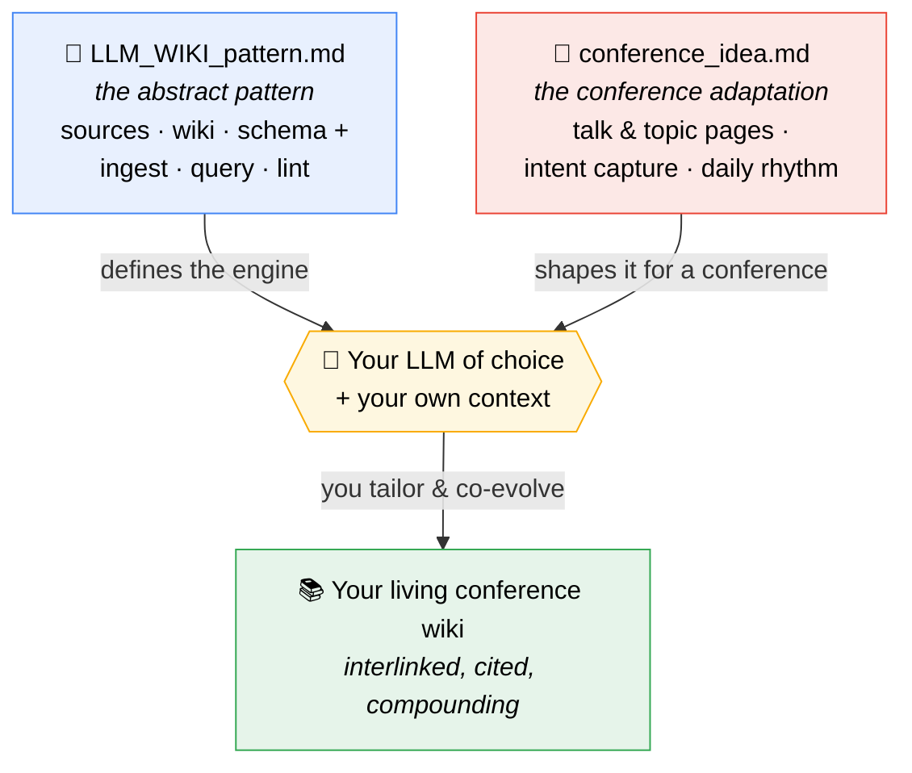

# LLM Wiki for Conferences

An application of [Karpathy's LLM Wiki](https://gist.github.com/karpathy/442a6bf555914893e9891c11519de94f) pattern

Two short documents that, handed to an LLM together, turn it into a disciplined maintainer of a personal **conference wiki** — a structured, interlinked, fully-cited knowledge base that gets richer with every talk you attend.

## The two files

| File                                         | What it is                                                                                                                                        | What it gives you                                                                                                                                                                                                  |
| -------------------------------------------- | ------------------------------------------------------------------------------------------------------------------------------------------------- | ------------------------------------------------------------------------------------------------------------------------------------------------------------------------------------------------------------------ |
| [`LLM_WIKI_pattern.md`](LLM_WIKI_pattern.md) | The **abstract pattern** — domain-agnostic. Fork of Karpathy's [LLM Wiki Gist](https://gist.github.com/karpathy/442a6bf555914893e9891c11519de94f) | The three-layer architecture (sources / wiki / schema), the core operations (ingest, query, lint), and the feedback loops that make knowledge *compound* instead of being re-derived on every question.            |
| [`conference_idea.md`](conference_idea.md)   | The **conference adaptation** of that pattern.                                                                                                    | Conference page types (talks, speakers, topics, reflections), the daily rhythm (prepare → ingest between talks → reflect at end of day), and intent capture — the questions that calibrate every summary to *you*. |

Read them in that order. The pattern is the engine; the conference file is the body built around it.

## What the combination offers

- **Knowledge that compounds.** Each talk you ingest thickens a web of cross-references, so the next talk integrates faster and every query synthesizes deeper.
- **Grounded, never invented.** Every claim cites a source; genuine gaps are marked `**Missing Info**` rather than filled with plausible filler.
- **Tailored to you.** A persona — inferred partly from which talks you chose and why — steers what each summary emphasizes, skips, and connects.
- **An artifact that outlives the event.** When the conference ends you have a searchable, interlinked wiki, not a folder of half-readable notes.

## How to use them

These two files are **loose instructions, not a finished product.** They describe the idea and give you enough to build your own; they expect to be tuned.

1. **Give both files to the LLM of your choice** (Claude Code, ChatGPT, or any assistant that can read and write local files).
2. **Ask it to set up your wiki** following them — a schema file with *your* persona, the conference page types, and the operations rhythm.
3. **Tailor it to your case:** your field, your goals, the conference you're attending, the note-taking style you actually use. Generic out of the box, sharp once tuned.
4. **Co-evolve as you go.** When a workflow doesn't fit, have the LLM revise the schema. The setup you finish the conference with should look different from the one you started with — that's the point.

## Interactive learning skill

The [`interactive-learning`](skills/interactive-learning/SKILL.md) skill turns the LLM into a Feynman-style teacher that quizzes you on wiki topics through progressive conceptual questions and adaptive depth — not recall, but building durable intuition. It's especially useful after ingesting a talk, when you want to stress-test whether you actually understood the core ideas.

> Pair the LLM with a markdown viewer that renders wikilinks and Mermaid (e.g. Obsidian): the LLM writes, you browse the graph in real time.
